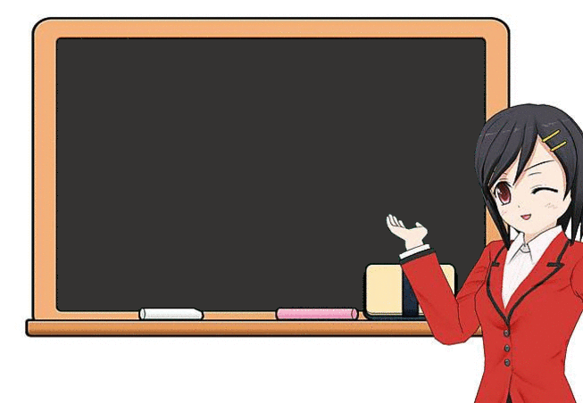
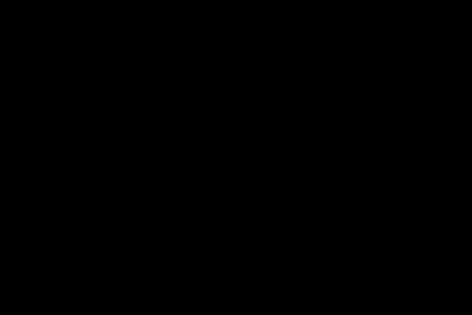

# gifmaze

[](https://opensource.org/licenses/MIT) []()

<p align="center"></p>


## Installation

You can install either via pypi:

```bash
pip install gifmaze
```
or via git

```bash
git clone https://github.com/neozhaoliang/gifmaze gifmaze && cd gifmaze && python setup.py install
```

## Why you need this lib

**Q:** I'm a fan of Python and also a fan of maze generation and maze solving algorithms. I have always been jealous of other people's awesome animations of this kind (like [here](https://bl.ocks.org/mbostock/11357811), [here](https://bl.ocks.org/mbostock/c03ee31334ee89abad83) and [here](http://weblog.jamisbuck.org/2011/2/7/maze-generation-algorithm-recap)), how could I make my own animations with python and show them to other people? (I know `tkinter`, `pyglet` and `pyqt` are nice GUIs but they cannot be published directly to the web ...)

**A:** Now you have this lib `gifmaze` which can help you make even more awesome GIF animations! It has some very nice features:

1. It's written in pure Python, no third-party libs/softwares are required, only built-in modules! (If you want to embed the animation into an image, then `PIL` is required, which is not built-in but comes with all Python distributions, that's all!)

2. It runs very fast and generates optimized GIF files in a few seconds. Usually the output file contains more than one thousand frames but the file size is only around a few hundreds of KBs.

3. You can make GIF animations of all kinds of maze generation and maze solving algorithms on the planar grid graph. 

4. It's fully commented, fully exampled and fully documented!


## A tutorial on this lib


**Q:** Cool! Is it easy to use?

**A:** Yes! Let me show you with an example:

Firstly we need to declare an `GIFSurface` (similar with `cairo`'s `ImageSurface` class) on which the animations are drawn and which specifies the size of the image and how many colors are available:

``` python
import gifmaze as gm

surface = gm.GIFSurface(width=600, height=400, color_depth=2, bg_color=0)
```
Here `color_depth=2` means there are 2^2=4 colors in the global color table, and `bg_color=0` means the 0-th color in the global color table is used as the background color.

You may define the global color table at any time except must before you save the image. Let's say it's

``` python
surface.set_palette([0, 0, 0, 255, 255, 255, 255, 0, 255, 0, 0, 0])
```
So the colors available in the image are black, white, magenta and black.

Then we build an environment (similar to `cairo`'s `Context` class) for making animations on top of this surface:

``` python
anim = gm.Animation(surface)
```
and we set some control parameters of this animation:

``` python
anim.set_control(speed=20, delay=5, trans_index=3)
```
This means "render a frame every 20 steps, set the delay time between successive frames to 0.05 second, and the color of index 3 in the global color table as the transparent channel".

Now we have a gif surface to draw on, an environemnt to control how the animation is rendered, then the last thing is to add a maze to run the algorithm.

``` python
maze = anim.create_maze_in_region(cell_size=5, region=8, mask=None)
```
This creates a maze located at the center of the image with 8 pixels padded at the borders, and each cell in the maze occupies 5x5 pixels in the image.

Now let's run `Prim's algorithm` on this maze:

``` python
from gifmaze.algorithms import prim

anim.pad_delay_frame(200)
prim(maze, start=(0, 0))
anim.pad_delay_frame(500)
```
Note I have padded two delay frames to help to see the animation clearly.

That's all! Let's save the animation to a gif file:

``` python
surface.save('prim.gif')
surface.close()
```
The result is shown below (<300KB, very optimized), enjoy it!

<p align="center"></p>

Of course you can combine several algorithms together into one animation, for example the next image shows the `random depth first search` and `A* search`: (it's only 120KB)

<p align="center"></p>

For more information please see this [blog](http://www.pywonderland.com/wilson/).


## How it works

The lib implemented a simple GIF encoder, and the frames are encoded to a BytesIO file in memory while the algorithm runs. Then one calls the `save()` method to flush the data to the output file.

To implement your own algorithm to animate, you may refer to the examples in `algorithms.py`, the basic idea is to split the algorithm into "atom" steps, set the values of the cells as the algorithm runs and call the `refresh_frame` method in each "atom" step.

## References

1. [What's in a gif.](http://www.matthewflickinger.com/lab/whatsinagif/bits_and_bytes.asp) The most helpful and may be the only resource you will need for learning the GIF89a specification.

2. [Maze generation algorithms.](http://weblog.jamisbuck.org/2011/2/7/maze-generation-algorithm-recap) A useful webpage for learning various maze generation algorithms. 


